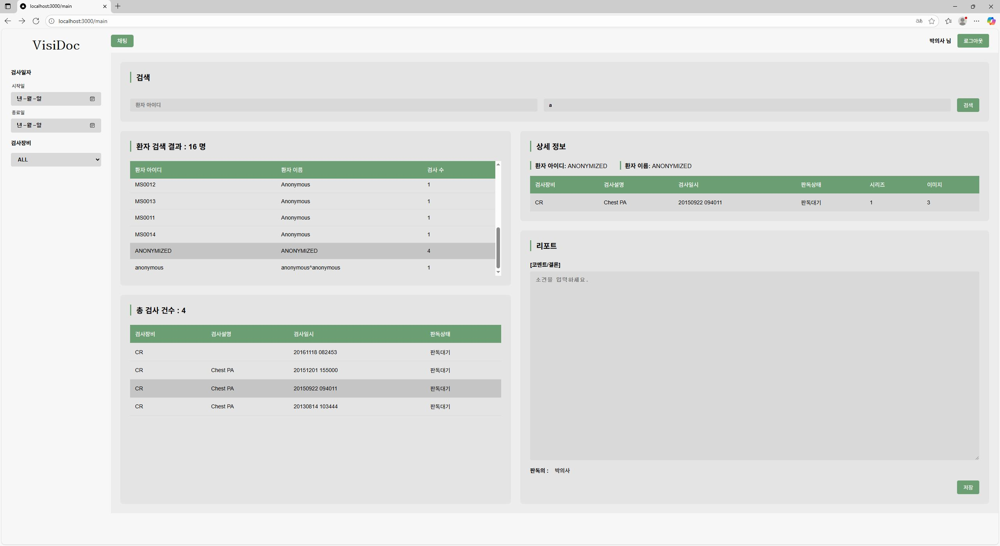
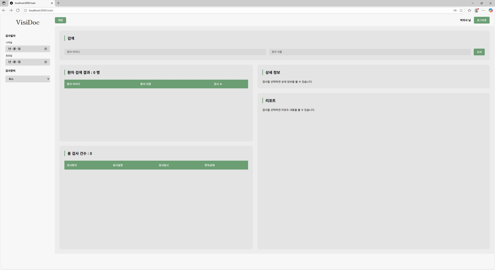
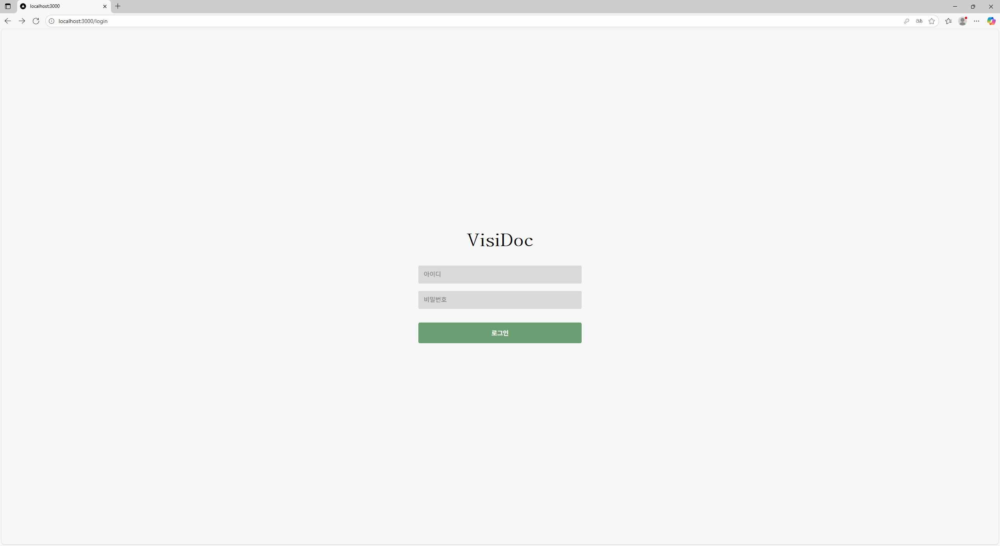
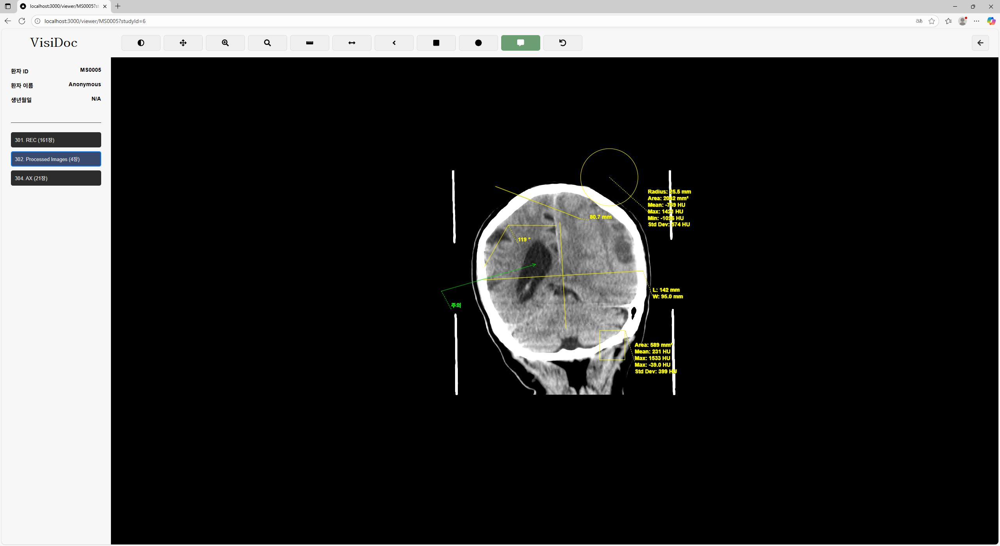

## 🔬 VisiDoc

    

## 🚀 프로젝트 소개
#### "분산된 데이터베이스와 전문적인 의료 API를 어떻게 하나의 완벽한 웹 서비스로 통합할 수 있을까?" 이 질문이 바로 저희 VisiDoc의 핵심 과제였습니다. 

저희는 이미 웹에서 강력한 기능을 제공하는 PacsPlus를 벤치마킹하여, 최신 기술 스택으로 안정적인 의료 이미지 조회 시스템을 구축하는 것을 목표로 삼았습니다. 이를 위해 Spring Boot의 견고한 백엔드와 Next.js(React)의 유연한 프론트엔드를 선택했습니다.

이 프로젝트의 핵심은 단순히 기능을 구현하는 것을 넘어, 사내 서버의 Oracle DB와 클라우드의 AWS RDS를 동시에 연동하는 백엔드 아키텍처를 설계하고, Cornerstone.js API를 활용하여 전문적인 DICOM 뷰어를 웹상에 안정적으로 구현해내는 것이었습니다.
  

##### 사이트 주소: https://visidoc.zaristory.com  ( ※ 데모 계정: ID: guest / PW: guest1234 )
※ 참고: 클라우드 배포 버전은 보안 정책상 학교 내 Oracle DB 연동이 제외되어, 환자 검색 및 뷰어 등 핵심 기능이 동작하지 않습니다.
  
##### 설치 방법: <a href="docs/설치방법/README.md" target="_blank">설치방법</a>
 

### 🛠️ 주요 기능 (Key Features)
| 기능 | 설명 | 관련 기술 |
| :---: | --- | :---: |
| **보안 인증 및 인가** | Spring Security와 **JWT**(JSON Web Token)를 결합하여 견고한 인증/인가 시스템을 구현했습니다. 사용자의 역할(의료진)에 따라 접근 권한을 제어하여 민감한 의료 데이터를 안전하게 보호합니다.| `Spring Security`, `JWT`|
| **하이브리드 API 설계**| **GraphQL과 REST API를 목적에 맞게 함께 사용**하는 하이브리드 방식을 채택했습니다. 복잡하게 연관된 의료 데이터(환자-연구-시리즈) 조회는 **GraphQL**로, 의사 소견서 작성이나 이미지 파일 요청처럼 명확한 기능은 **REST API**로 처리하여 API를 최적화했습니다.| `GraphQL`, `REST API`, `Spring Boot`|
| **인터랙티브 DICOM 이미지 뷰어**| 전문 라이브러리인 **Cornerstone.js API를 활용**하여 DICOM 이미지를 렌더링하고, 필수 분석 도구(Zoom, Pan, Windowing 등)를 제공합니다. 또한, 실제 파일 경로를 숨기기 위해 **서버에서 디코딩 과정을 거쳐 이미지를 안전하게 스트리밍하는 보안 전송 메커니즘**을 REST API로 직접 구현했습니다. | `Cornerstone.js`, `REST API`, `Spring Boot`|
| **분산 데이터 통합 조회**| 학교 DB(Oracle)의 **환자/연구 정보**와 AWS RDS(PostgreSQL)의 **의사 소견 정보**를 백엔드에서 **실시간으로 통합**하여, 사용자에게는 하나의 완성된 정보처럼 보여주는 기능을 구현했습니다.  | `Spring Boot`, `JPA`, `JPQL`|
| **목적 중심의 데이터베이스 아키텍처** | **학교 서버(Oracle DB)의 PACS 연동 데이터**와 자체적으로 구축한 **AWS RDS(PostgreSQL)의 애플리케이션 데이터(의사 정보, 소견서 등)를 물리적으로 분리**하여 설계했습니다. 이를 통해 데이터의 성격에 따라 관리 포인트를 분리하고 시스템의 유연성을 확보했습니다.| `Multi-Datasource`, `Oracle DB`, `PostgreSQL` |
| **웹소켓 기반 실시간 협업 채팅** | Spring WebSocket과 STOMP 프로토콜을 활용하여 의료진 간의 실시간 소통 및 협업이 가능한 채팅 기능을 구현했습니다. 이를 통해 특정 환자나 이미지에 대한 의견을 즉각적으로 교환하며 진단의 효율성을 높일 수 있습니다. | `Spring WebSocket`, `STOMP`, `SockJS` |

 
 

## 👥 팀원 
|박규태|김동현|김윤진|
|:---:|:---:|:---:|
|<a href="https://github.com/ZaRi1l" target="_blank"> ZaRi1l</a>|<a href="https://github.com/kimdonghyun296" target="_blank"> kimdonghyun296</a>|<a href="https://github.com/yunndaeng" target="_blank"> yunndaeng</a>|

#### 맡은 역할
| 이름 |업무|
|:---:|---|
|박규태|**프론트엔드**   - 백엔드 API 연동 기반의 이미지 로딩 및 뷰잉 워크플로우 전체 구현   - Cornerstone.js를 활용한 DICOM 이미지 뷰어 및 분석 도구(Zoom, Pan 등) 최종 개발   **백엔드**   - Multi-Datasource 아키텍처 설계 (Oracle & PostgreSQL 동시 연동)   - Native SQL 기반 Oracle DB 데이터 조회 로직 구현   - 환자 정보 조회를 위한 GraphQL API 및 이미지 보안 전송 REST API 구축   - Swagger API 문서화   **데브옵스**   - AWS 기반 인프라 구축 (EC2, RDS)   - CloudFront/ACM을 활용한 HTTPS 적용 및 커스텀 도메인 연결   - Docker & Github Actions 기반 CI/CD 파이프라인 구축   - Spring Boot 및 Next.js의 환경별(dev/prod) 구성 관리   **기타**    - 발표, 발표 자료 제작   - 영상 편집   - 프로젝트 기술 문서 구조 설계 및 작성 (README, docs)   - Class Diagram, Squence Diagram 작성|
|김동현|**프론트엔드**   - REST/GraphQL API를 연동하여 사용자 인증 흐름(로그인, 회원 생성) 구현   - 환자 검색(이름, ID, 날짜)부터 Study/Series로 이어지는 계층적 데이터 탐색(Drill-down) UI 개발   - 소견서 작성/조회 기능을 포함한 핵심 워크플로우를 개발   - React Context API를 활용한 전역 로그인 상태 관리 구현   - WebSocket 클라이언트(STOMP, SockJS)를 연동하여 실시간 채팅방 기능 및 UI 구현   **백엔드**   - PostgreSQL 기반의 애플리케이션 DB 설계   - JPA를 활용하여 PostgreSQL DB의 데이터 CRUD 계층 구현   - JWT와 Spring Security를 활용한 회원 인증 REST API 구축   - GraphQL Resolver를 통해 이종 데이터베이스(Oracle, PostgreSQL)의 데이터를 조합하는 소견서 작성 API 개발   - Spring WebSocket과 STOMP 프로토콜을 기반으로 실시간 채팅 기능 백엔드 구축    **기타**   - 시연, 발표 자료 제작   - 영상 촬영   - Usecase Diagram, Squence Diagram 작성|
|김윤진|**프론트엔드**   - CSS Modules를 활용하여 로그인, 메인 대시보드, 뷰어, 관리자 페이지 등 모든 핵심 페이지의 UI 개발과 반응형 웹 디자인을 담당   - DICOM 뷰어의 초기 기술 검증(PoC) 및 로컬 이미지 렌더링 프로토타입을 구현   **UI/UX 디자인**    - Figma를 활용하여 프로젝트의 전체 UX/UI 및 디자인 시스템 설계   **기타**    - Component Diagram 작성|

  
## 💻 개발 환경

| Backend | Frontend | VCS |
|:---:|:---:|:---:|
|| ||
|Spring Boot|React, Next.js|GitHub|

| CSP | Database | DevOps |
|:---:|:---:|:---:|
|| |  |
|AWS|Oracle, PostgreSQL|Docker, GitHub Actions|

| Language | IDE | Build Tool |
|:---:|:---:|:---:|
|    | | |
|Java, TypeScript, JS, HTML, CSS|IntelliJ, VSCode|Gradle, NPM|

 

### ⚙️ 개발 환경 상세

#### Backend

| 구분 | 사용 기술 | 버전 |
|:---:|:---|:---:|
| **Framework** |  | 3.5.4 |
| **Language** |  | 21 |
| **API** |   | - |
| **WebSocket** |  | - |
| **Data Access** |  | - |
| **Security** |   | - |
| **API Docs** |  | 2.8.9 |
| **File Access** |  | 2.1.10 |
| **Build Tool** |  | - |

 

#### Frontend

| 구분 | 사용 기술 | 버전 |
|:---:|:---|:---:|
| **Framework**|  | 15.4.6 |
| **Library** |   | 19.1.0 / ^5.5.0 |
| **Language** |   | ^5 / ES6+ |
| **Data Fetching** |   | 3.10.4 / 1.11.0 |
| **WebSocket** |   | ^7.1.1 / ^1.6.1 |
| **Security** |  | ^4.0.0 |
| **DICOM Viewer** |  | ^3.33.2 |
| **Package Manager**|  | - |

 

#### Infrastructure & DevOps

| 구분 | 사용 기술 |
|:---:|:---|
| **Cloud Provider** |  |
| **Used Services** |   |
| **Database** |   |
| **CI/CD** |  |
| **Containerization**|  |
| **VCS & IDE** |    |

  
## 📋 요구사항

    

#### 요구사항 분석(기능 정리)
| 요구사항 | 상세내용 |
| :---: | --- |
| **사용자 인증 및 계정 관리** | 안전한 시스템 접속을 위한 로그인/로그아웃, 역할에 따른 기능 접근 제어 |
| **의료 데이터 통합 조회** | 여러 곳에 저장된 환자, 검사, 소견 정보를 한 화면에서 통합 조회, 환자 및 날짜 등 다양한 조건으로 검사 기록 검색, 환자-검사-시리즈로 이어지는 체계적인 데이터 탐색 |
| **DICOM 이미지 뷰어 및 분석** | 웹 브라우저에서 DICOM 의료 영상을 확인, 영상 판독을 위한 필수 분석 도구(확대/축소, 이동, 밝기/대비 조절) 사용 |
| **의사 소견 관리** | 특정 검사에 대한 의사 소견서 작성, 저장 및 조회 |
| **관리자 기능** | 사용자 계정 생성 및 DICOM 파일 관리 |

  
<!-- ## ▶️ 구현 영상 -->

## 🖼️ 구현 사진
### 메인화면

### 로그인

### 뷰어

 

## 🖼️ 구현 사진 상세
<a href="./docs/구현사진/" target="_blank">구현 사진 상세</a>

  

## ⚙️ 소프트웨어 설계
<a href="./docs/Diagram/" target="_blank">소프트웨어 설계</a>
 

  
